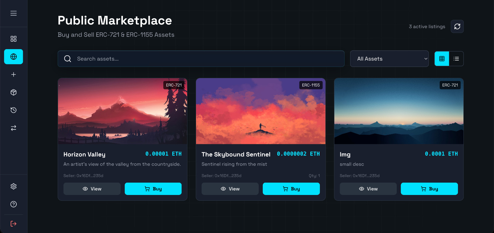

# BSATSF

A blockchain asset management platform built with React, TypeScript, and Web3 integration.



## Features & Implementation Summary

### 1. MetaMask & Multi-Account Integration
- **Wallet Connection:** Automated detection, permission requests, and state synchronization via React contexts.
- **Account Selector:** Native dropdown in sidebar allowing users to switch between multiple MetaMask accounts with live permission and balance updates.
- **Network Validation:** Enforcement of the Sepolia testnet environment with automatic chain checks.

### 2. Asset Minting & Decentralized Storage
- **IPFS Integration:** Decentralized asset metadata and raw file storage via a drag-and-drop workflow.
- **Dual Token Support:** - **ERC-721:** Minting unique individual assets featuring customizable form metadata.
  - **ERC-1155:** Multi-token creation support specifying fractional batch quantities and strict total supply limits.

### 3. Personal Dashboard & Public Marketplace
- **Dashboard Registry:** Browse your personal collection of owned ERC-721 and ERC-1155 tokens using localized search and filtering parameters.
- **Public Marketplace:** Global discovery grid/list interface showcasing listed assets across all connected ecosystem wallets, fetching decentralized media dynamically.
- **Trading Escrow:** List items with custom designated ETH valuations per unit and securely purchase assets globally.

### 4. Controlled Transfers & Protocol Fees
- **ETH Transfer Fees:** Configured with a default base contract premium of `0.001 ETH` per transaction routing transfer fees straight to the protocol owner.
- **Safe Transfers:** Built-in recipient wallet address validations, multi-state confirmations, and atomic excess-payment refund sweeps.

### 5. Transaction Receipts, History & Verification
- **Transaction Ledger:** Comprehensive paginated and filterable table displaying histories alongside data export functionality.
- **Receipt Insights:** Immersive review of execution logs detailing tx hashes, tracking blocks, gas consumed, and timestamps.
- **Asset Verification:** Public registry search module to query provenance records by transaction hashes or Token IDs directly referenced against Sepolia Etherscan.

## Tech Stack

- **Frontend:** React 18 with TypeScript for structural type safety
- **Web3 Libraries:** Ethers.js for blockchain interactions and MetaMask handshakes
- **Smart Contracts:** Solidity v0.8.20 + OpenZeppelin Contracts library
- **Development Tooling:** Hardhat environment for building, compiling, and network deployments
- **Styling:** Tailwind CSS with custom glassmorphism and animated backdrop blurring layouts
- **Animations:** Framer Motion for interactive layout configurations
- **Routing & Feedback:** React Router & React Hot Toast alerts

## Smart Contract Profiles

### `BSATSF_ERC721.sol`
- ERC-721 non-fungible asset instantiation utilizing an internal auto-increment token counter.
- Embedded native payment handling enforcing `transferFee` collections with automated user refunds.
- Comprehensive `getAllAssets()` and `getMyAssets()` display views minimizing frontend query loads.

### `BSATSF_ERC1155.sol`
- Semi-fungible multi-token standard tracking creator records and balance configurations.
- Supports individual asset generation, supply expansions, or combined custom multi-asset array generation through `mintBatch()`.
- Custom inherited `burn()` and `burnBatch()` supply management protocols.

### `BSATSF_Marketplace.sol`
- Central trustless trade execution routing and listings validation logic supporting both ERC-721 and ERC-1155.
- Atomic operations verifying safety approval handshakes, settlement payouts, and immediate item delivery.

## Application Architecture Flow

### User Journey:
1. **Connect Wallet** → Access the dApp via MetaMask and perform network or multi-account validation checks.
2. **View Marketplace** → Discover all globally active public asset items available for purchase.
3. **Mint Assets** → Push files and corresponding metadata objects into IPFS to submit live on-chain mint entries.
4. **Transfer Assets** → Select specific collection tokens, fill in verification parameters, pay required fees, and commit ownership adjustments.
5. **View Ledger Receipts** → Verify operational validity using interactive historical logs detailing performance parameters linked to Etherscan.

## Getting Started

### Prerequisites

- Node.js (Version 16 or newer) + npm package manager
- MetaMask browser extension
- Access to Sepolia testnet with loaded faucet funds

## Accounts to Create (Free)
- MetaMask: wallet for user, deployer, and test accounts
- Infura: free account/project to get Sepolia RPC (`REACT_APP_INFURA_PROJECT_ID`)
- Etherscan: free API key for contract verification (`ETHERSCAN_API_KEY`)
- web3.storage: free token to pin files and metadata to IPFS (`WEB3_STORAGE_TOKEN`)
- Optional: Pinata (alternative IPFS), Alchemy (alternative RPC)

### Installation

1. **Install dependencies:**
   ```bash
   npm install
   ```

2. **Provide contract addresses**

   Populate the following environment variables before running or building. The
   `generate-addresses` script will emit `public/contracts/addresses.json`
   automatically.
   ```bash
   export REACT_APP_ERC721_ADDRESS=0xYour721Address
   export REACT_APP_ERC1155_ADDRESS=0xYour1155Address
   export REACT_APP_MARKETPLACE_ADDRESS=0xYourMarketplace
   export REACT_APP_NETWORK_NAME=sepolia
   export REACT_APP_CHAIN_ID=11155111
   npm run generate:addresses   # optional; runs automatically before start/build
   ```

3. **Start development server:**
   ```bash
   npm start
   ```

4. **Build for production:**
   ```bash
   npm run build
   ```

### Usage

1. **Connect MetaMask** - Click "Connect with MetaMask" button
2. **Switch to Sepolia** - Ensure you're on Sepolia testnet
3. **Browse Assets** - View tokenized assets in the dashboard
4. **Mint New Assets** - Upload files to IPFS and create new tokens
5. **Transfer Ownership** - Send assets to other wallet addresses
6. **View Transactions** - Monitor all blockchain transactions
7. **Verify Assets** - Lookup assets by token ID or transaction hash

## Project Structure

```
src/
├── components/           # React components
│   ├── ConnectWallet.tsx    # MetaMask connection
│   ├── Dashboard.tsx        # Asset registry grid
│   ├── MintAsset.tsx        # IPFS upload & minting
│   ├── TransactionLedger.tsx # Transaction history
│   ├── TransferOwnership.tsx # Asset transfers
│   ├── AssetDetail.tsx      # Individual asset view
│   └── VerifyAsset.tsx      # Asset verification
├── contexts/             # React contexts
│   └── Web3Context.tsx      # Web3 state management
├── App.tsx              # Main app component
├── index.tsx            # App entry point
└── index.css            # Global styles
```

## Design System

- **Color Palette**: Dark theme with cyan accents (#00E0FF, #00B8D9)
- **Typography**: Space Grotesk font family
- **Components**: Glass morphism effects with backdrop blur
- **Animations**: Token orbits, grid backgrounds, loading states
- **Responsive**: Mobile-first design with Tailwind breakpoints

## Web3 Integration

- **Wallet Connection**: MetaMask detection and connection
- **Network Validation**: Automatic Sepolia testnet verification
- **Smart Contracts**: ERC-721 and ERC-1155 token support
- **Transaction Handling**: Ethers.js for blockchain interactions
- **Error Handling**: User-friendly error messages and fallbacks

## Security & Cost Controls
- All operations are on Sepolia testnet (free faucet ETH)
- No secret logging; read env vars only
- Basic checks in UI for addresses and balances; error toasts
- Marketplace requires approval before listing to prevent unauthorized transfers

## Contributing

1. Fork the repository
2. Create a feature branch (`git checkout -b feature/amazing-feature`)
3. Commit your changes (`git commit -m 'Add amazing feature'`)
4. Push to the branch (`git push origin feature/amazing-feature`)
5. Open a Pull Request

## License

This project is licensed under the MIT License.

## Support

For support, please open an issue in the GitHub repository or contact the development team.
